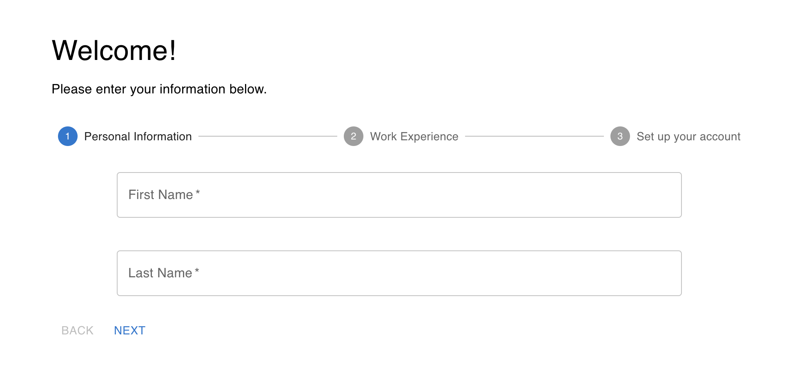

# application-nodejs-react

# Lead Form Application



This is a simple web application with two directories: `lead-form` and `api`. The `lead-form` directory contains a frontend project created with Create React App, while the `api` directory contains a basic API built with Express.js.

## Getting Started

### Prerequisites

Before running the application, make sure you have the following installed:

- [Node.js](https://nodejs.org/)
- [npm](https://www.npmjs.com/)

### Installation

### Step 1: Clone the repository to your local machine:

   ```bash
   git clone https://github.com/zbango/application-nodejs-react.git
```
    
### Step 2: Set up the `lead-form` application

Navigate to the `lead-form` directory and install the necessary dependencies:

```bash
cd lead-form
npm install
```
### Step 3: Run the `lead-form` application

To launch the `lead-form` application on your local development server, run the following command:

```bash
npm run start
``````

### Step 4: Set up the API

Before starting the server, you'll need to set up the environment variables:

1. Create a `.env` file in the root of the `api` directory.
2. Add the following lines to the `.env` file:

```plaintext
PORT=YourDesiredPortNumber
COGNITO_APP_CLIENT_ID=YourCognitoAppClientId
```

Navigate to the `api` directory, install dependencies, and start the API server:

```bash
cd api
npm install
npm start
```
The API should now be running at the specified port.

## API Endpoints

- `POST /users`: Registers a new user with the provided email, password, first name, and last name. This endpoint also interacts with Amazon Cognito for user authentication.

## Contributing

If you'd like to contribute to this project, please follow these guidelines:

1. Fork the repository on GitHub.
2. Clone your forked repository to your local machine.
3. Create a new branch for your feature or bug fix.
4. Make your changes and test thoroughly.
5. Push your changes to your forked repository.
6. Create a pull request to merge your changes into the main repository.

## License

This project is licensed under the MIT License - see the [LICENSE](LICENSE) file for details.

## Acknowledgments

- [Create React App](https://reactjs.org/docs/create-a-new-react-app.html#create-react-app)
- [Express.js](https://expressjs.com/)
- [Amazon Cognito](https://aws.amazon.com/cognito/)